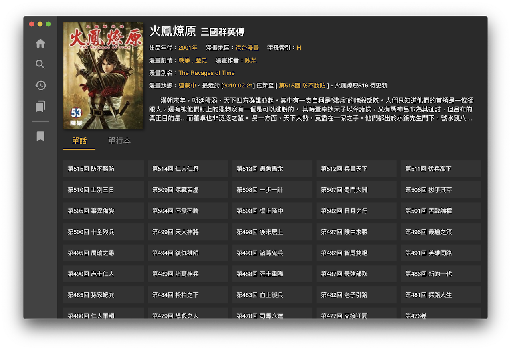
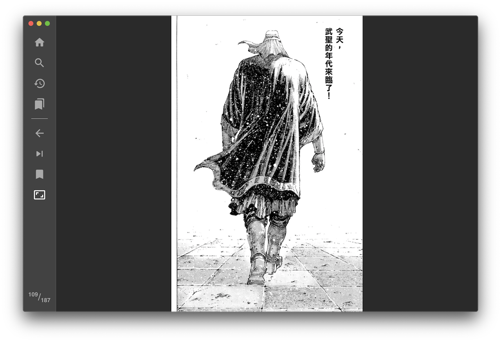

## Desktop Comic Reader

An Electron based comic reader.

- Data are scrape from [https://www.manhuagui.com](https://www.manhuagui.com)
- Built from [iRath96/electron-react-typescript-boilerplate](https://github.com/iRath96/electron-react-typescript-boilerplate)
- Inspired by [ComicsReader](https://github.com/ComicsReader/app) and [Arachnid-27/Cimoc](https://github.com/Arachnid-27/Cimoc)





## :warning: Warning

- Your IP has an opportunity that banned by the data owner. In my experience, you will unlock after around one day.

## Development

Start the app in the `dev` environment. <br>
**There is some issue on hot updates, you may need to refresh few time after edit**

```bash
yarn dev
```

If you don't need autofocus when your files was changed, then run `dev` with env `START_MINIMIZED=true`:

```bash
START_MINIMIZED=true yarn dev
```

#### Create a Component

You can create a react component files quickly by below command

```bash
yarn component ComponentName
```

## Packaging

To package apps for the local platform:

```bash
yarn package
```

To package apps for all platforms:

First, refer to the [Multi Platform Build docs](https://www.electron.build/multi-platform-build) for dependencies.

Then,

```bash
yarn package-all
```

To package apps with options:

```bash
yarn package --[option]
```

## Credit

- [App Icon created by ncrow](https://www.deviantart.com/ncrow/art/ComicBunch-Icon-189969026)

## License

[MIT](./LICENSE)

## Disclaimer

This project is for technical testing and educational purposes only. The owner and contributors do not assume any legal responsibilities caused by the users. Users should be aware of and take the risks.
