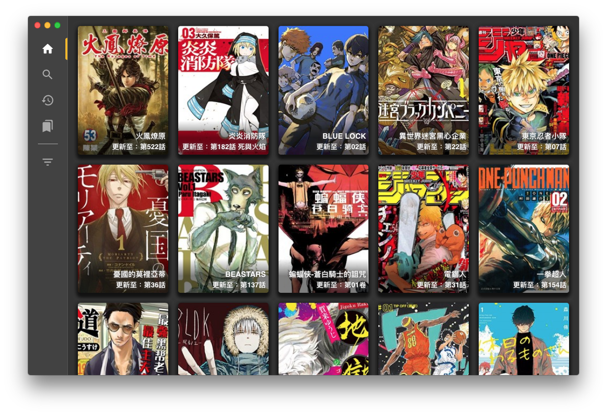
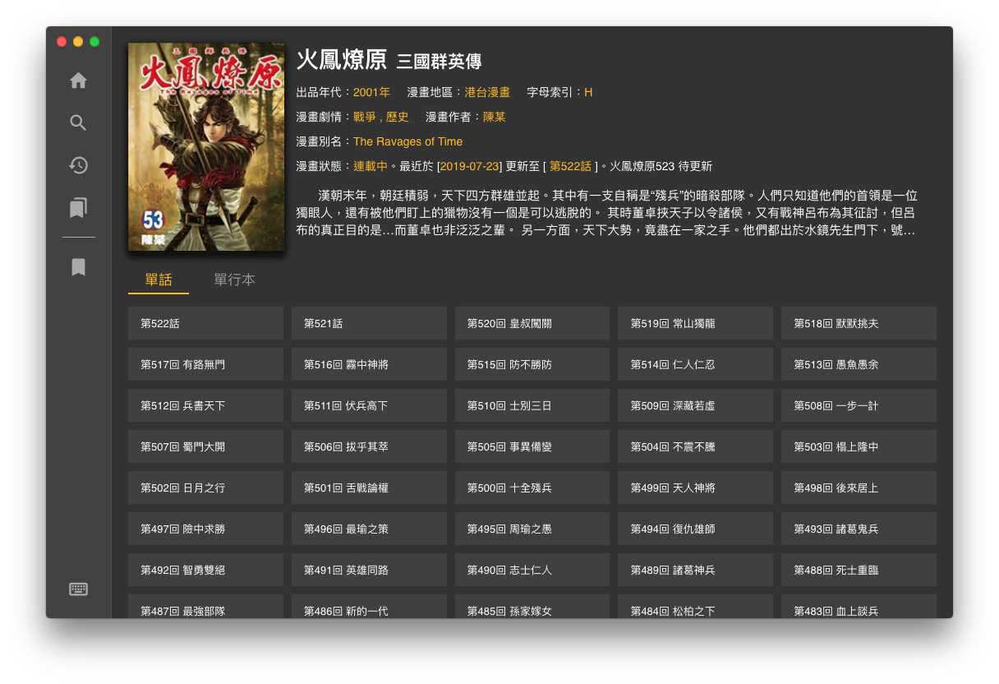

## Desktop Comic Reader

An Electron based comic reader.

- Data is scrape from [https://www.manhuagui.com](https://www.manhuagui.com)
- Built from [electron-with-cra-ts](https://github.com/Pong420/electron-with-cra-ts)
- Inspired by [ComicsReader](https://github.com/ComicsReader/app) and [Arachnid-27/Cimoc](https://github.com/Arachnid-27/Cimoc)





### :warning: Warning

- Your IP has an opportunity that banned by the data owner. In my experience, you will unlock after around one day.

### Development

```
yarn dev
```

### Packaging

To package apps for the local platform:

```
yarn package
```

First, refer to the [Multi Platform Build docs](https://www.electron.build/multi-platform-build) for dependencies. Then,

```
yarn package-all
```

## Credit

- [App Icon created by ncrow](https://www.deviantart.com/ncrow/art/ComicBunch-Icon-189969026)

## License

[MIT](./LICENSE)

## Disclaimer

This project is for technical testing and educational purposes only. The owner and contributors do not assume any legal responsibilities caused by the users. Users should be aware of and take the risks.
